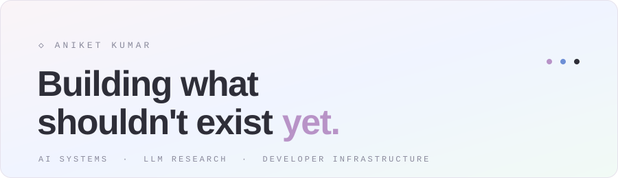
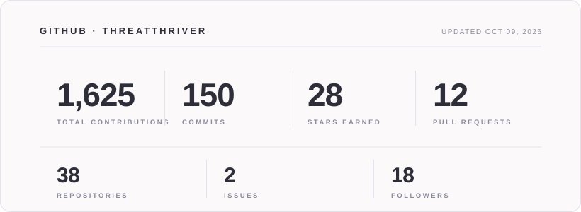

<!--
  Profile README.
  - Colored text uses GitHub math: $\color{#hex}{\textsf{...}}$ (CSS is stripped by GitHub).
  - Hero + stats card are SVGs in /assets, regenerated daily by .github/workflows/stats.yml.
  - Snake lives on the `output` branch, regenerated daily by .github/workflows/snake.yml.
  Palette: purple #B893C7 · periwinkle #6D8FD6 · sage #83BFA3 · muted #8A8A9C
-->

 

 

$\color{#B893C7}{\textsf{01 \ / \ ABOUT}}$

## I build between research and real products.

I experiment with language models, build AI-native applications, and turn ideas into working systems, usually from first principles.

$\color{#6D8FD6}{\textsf{Understand}} \ \color{#8A8A9C}{\rightarrow} \ \color{#6D8FD6}{\textsf{Build}} \ \color{#8A8A9C}{\rightarrow} \ \color{#6D8FD6}{\textsf{Experiment}} \ \color{#8A8A9C}{\rightarrow} \ \color{#6D8FD6}{\textsf{Measure}} \ \color{#8A8A9C}{\rightarrow} \ \color{#B893C7}{\textsf{Repeat}}$

 

$\color{#B893C7}{\textsf{02 \ / \ BUILDING}}$

## Two ventures.

### [SenderWire ↗](https://senderwire.com)

Cloud infrastructure built for startups. Compute, on-demand GPUs, managed Postgres and S3-compatible storage, with simple pay-as-you-go pricing.

  

### [OXPID ↗](https://oxpid.in)

Small models, tuned in the open. Open-weight models fine-tuned for narrow, real tasks, with every run, adapter and eval published for anyone to rerun.

  

 

$\color{#B893C7}{\textsf{03 \ / \ PROJECTS}}$

## Experiments worth keeping.

- **[Qwen3-0.6B LoRA](https://huggingface.co/Threatthriver/qwen3-0.6b-alpaca-lora)** · LoRA fine-tuning built around Qwen3-0.6B.
- **[Research archive](https://github.com/threatthriver?tab=repositories)** · Model behavior, fine-tuning and emerging AI techniques.

 

$\color{#B893C7}{\textsf{04 \ / \ STACK}}$

## Kept deliberately small.

$\color{#B893C7}{\textsf{AI}}$ PyTorch · Transformers · LoRA · Hugging Face 
$\color{#6D8FD6}{\textsf{WEB}}$ React · Next.js · TypeScript 
$\color{#83BFA3}{\textsf{BACKEND}}$ Node.js · PostgreSQL 
$\color{#8A8A9C}{\textsf{INFRA}}$ AWS · Docker · Linux

 

$\color{#B893C7}{\textsf{05 \ / \ GITHUB}}$

## The numbers, in the open.

<picture>
  <source media="(prefers-color-scheme: dark)" srcset="https://raw.githubusercontent.com/threatthriver/threatthriver/output/snake-dark.svg" />
  
</picture>

  

$\color{#8A8A9C}{\textsf{BUILD. \ EXPERIMENT. \ SHIP.}}$

