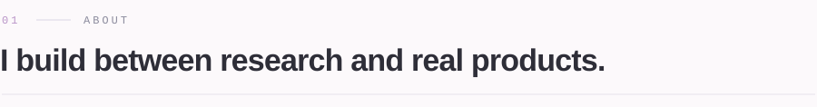
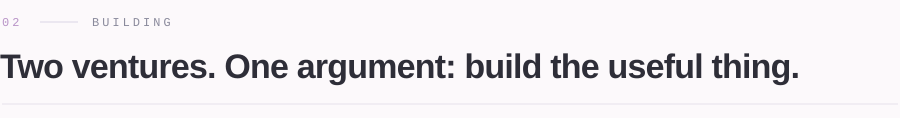
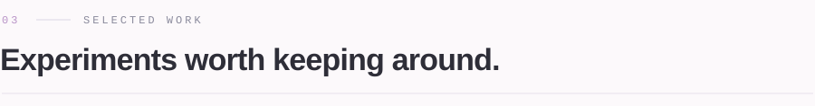
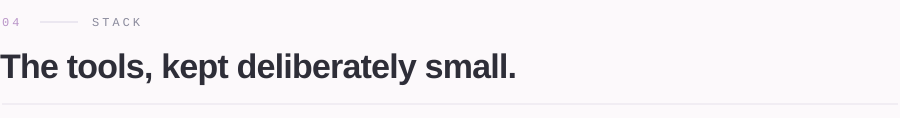
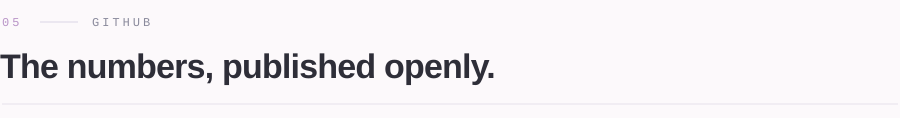
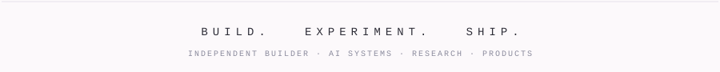

<!--
  Profile README — rendered with GitHub-safe HTML + SVG banners.
  Visual design (typography, letterspacing, colors) lives in the SVGs
  under /assets, generated by .github/scripts/generate_banners.py and
  generate_stats_card.py. GitHub strips <style>/class from markdown,
  so all real styling is baked into the images.
-->

  
  
  
  
  

 

<!-- ───────────────────────── 01 · ABOUT ───────────────────────── -->

<table width="100%">
  <tr>
    <td width="64%" valign="top">
      I experiment with language models, build AI-native applications, and turn ideas into working systems. Less interested in the standard path, more in what happens when you build from first principles.
        
      <b>Understand &rarr; Build &rarr; Experiment &rarr; Measure &rarr; Repeat.</b>
    </td>
    <td width="36%" valign="top">
      <samp>CURRENT FOCUS</samp> 
      AI Systems 
      LLM Research 
      AI Agents 
      Developer Infrastructure
        
      Currently building two ventures.
    </td>
  </tr>
</table>

 

<!-- ─────────────────────── 02 · BUILDING ───────────────────────── -->

<table width="100%">
  <tr>
    <td width="50%" valign="top">
      <h3>&#10022; SenderWire</h3>
      <samp>CLOUD &#183; GPUS &#183; INFRASTRUCTURE</samp>
      
Cloud infrastructure built for startups. Compute, on-demand GPUs, managed Postgres, and S3-compatible object storage with simple, pay-as-you-go pricing.

      <a href="https://senderwire.com"><b>senderwire.com &#8599;</b></a>
    </td>
    <td width="50%" valign="top">
      <h3>&#10022; OXPID</h3>
      <samp>LLMS &#183; LORA &#183; OPEN RESEARCH</samp>
      
Small models, tuned in the open. Fine-tuned open-weight models for narrow, real tasks, with the runs, adapters, and evals published for the community to rerun.

      <a href="https://oxpid.in"><b>oxpid.in &#8599;</b></a>
    </td>
  </tr>
</table>

 

<!-- ────────────────────── 03 · SELECTED WORK ───────────────────── -->

<table width="100%">
  <tr>
    <td width="50%" valign="top">
      <h3>&#129390; Qwen3-0.6B LoRA</h3>
      <samp>PYTORCH &#183; LORA &#183; HUGGING FACE</samp>
      
Experimental LoRA fine-tuning built around Qwen3-0.6B.

      <a href="https://huggingface.co/Threatthriver/qwen3-0.6b-alpaca-lora"><b>model &#8599;</b></a>
    </td>
    <td width="50%" valign="top">
      <h3>&#128218; Research Archive</h3>
      <samp>EXPERIMENTS &#183; RESEARCH &#183; PROTOTYPES</samp>
      
Work across model behavior, fine-tuning, and emerging AI techniques.

      <a href="https://github.com/threatthriver?tab=repositories"><b>explore &#8599;</b></a>
    </td>
  </tr>
</table>

 

<!-- ───────────────────────── 04 · STACK ────────────────────────── -->

  

<table width="100%">
  <tr>
    <td width="25%" valign="top"><samp>AI</samp> PyTorch Transformers LoRA Hugging Face</td>
    <td width="25%" valign="top"><samp>WEB</samp> React Next.js TypeScript</td>
    <td width="25%" valign="top"><samp>BACKEND</samp> Node.js PostgreSQL</td>
    <td width="25%" valign="top"><samp>INFRA</samp> AWS Docker Linux</td>
  </tr>
</table>

 

<!-- ───────────────────────── 05 · GITHUB ───────────────────────── -->

  

   

  <!-- Custom stats card (generated by .github/workflows/stats.yml) -->
  

   

  

    

  <!-- Contribution snake (generated by .github/workflows/snake.yml) -->
  <picture>
    <source media="(prefers-color-scheme: dark)" srcset="https://raw.githubusercontent.com/threatthriver/threatthriver/output/snake-dark.svg" />
    <source media="(prefers-color-scheme: light)" srcset="https://raw.githubusercontent.com/threatthriver/threatthriver/output/snake.svg" />
    
  </picture>

 

  

